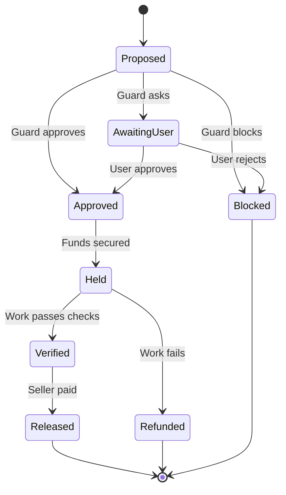
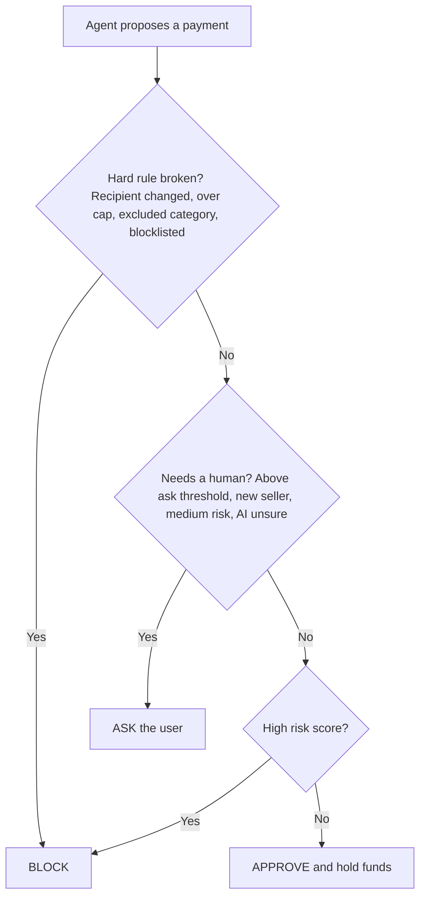
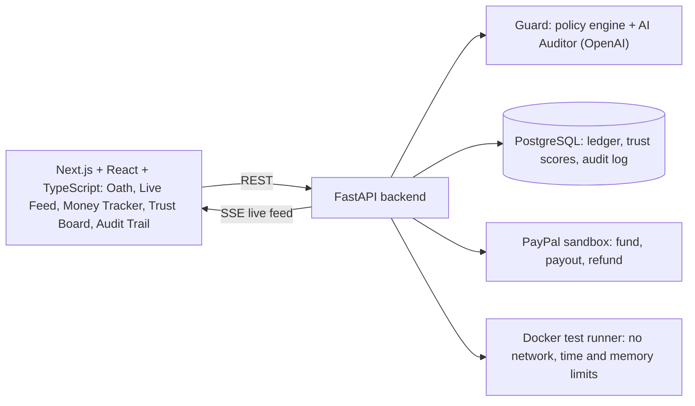

# Horkos
An AI guard that enforces spending rules and holds payments until the work is proven
# Horkos

**An AI guard that enforces your spending rules, holds payments until work is proven, and gives more freedom to sellers who earn trust.**


> In Greek mythology, *Horkos* is the spirit of oaths, who punishes anyone who breaks a promise. Horkos the app does the same job for AI agents that spend money.

---

## Table of contents

1. [The problem](#the-problem)
2. [What Horkos does](#what-horkos-does)
3. [How it works](#how-it-works)
4. [The Guard: how decisions are made](#the-guard-how-decisions-are-made)
5. [Earned autonomy](#earned-autonomy)
6. [How we use PayPal](#how-we-use-paypal)
7. [How we use AI](#how-we-use-ai)
8. [How we used APIMatic](#how-we-used-apimatic)
9. [Architecture and tech stack](#architecture-and-tech-stack)
10. [Getting started](#getting-started)
11. [Trying the demo](#trying-the-demo)
12. [Testing](#testing)
13. [Project structure](#project-structure)
14. [Safety and limitations](#safety-and-limitations)
15. [Roadmap](#roadmap)
16. [Team](#team)
17. [License](#license)

---

## The problem

AI agents can already shop, hire and pay on our behalf. What is missing is **trust**. Would you let an agent spend your money if it could be tricked into paying the wrong person, paying too much, or paying for work that was never delivered?

Today's options are blunt: a single spending cap, or a human approving every payment. Neither scales, and a numeric cap cannot tell whether a payment actually matches what you asked for.

## What Horkos does

Horkos sits between an AI agent and PayPal. It does four things:

1. **Enforces your rules.** You write your spending rules (your *oath*) in plain English. Horkos turns them into a policy it checks on every payment.
2. **Guards every payment.** A policy engine plus an AI Auditor review each proposed payment and answer **Approve**, **Block** or **Ask**, always with a plain-English reason.
3. **Holds the money until work is proven.** Funds are held in escrow. Automated tests and an AI Verifier check the delivered work. Pass, and the seller is paid. Fail, and you are refunded.
4. **Lets trust be earned.** New sellers get small limits and need approval. Sellers with a proven record get higher limits and are paid automatically. A failure tightens limits immediately.

**In one line:** agents can already spend money. Horkos makes it safe to let them.

### What makes it different

- **The Guard reads intent, not just numbers.** It compares each payment with what the user actually asked for, which a spending cap cannot do.
- **Hard rules beat AI.** The AI can make a decision more cautious, but it can never override a hard block. This is what makes it hard to talk the system into a bad payment.
- **Payment is tied to proof.** The seller's work is checked by automated tests in an isolated sandbox before any money is released.
- **Autonomy is earned, not granted.** Limits grow with a track record and shrink after a failure.
- **Every decision is explainable.** Each verdict is stored with a plain-English reason in an audit trail.

---

## How it works

A typical job, from Amara's point of view:

1. **Amara writes her rules once.** For example: "Spend up to $50 per job and $100 per day. Only on coding work. Ask me before anything unusual."
2. **Her Buyer Agent proposes a payment.** She asked for a script, and the agent finds a seller and proposes paying $20 if the delivered code passes agreed tests.
3. **The Guard reviews it.** It checks the proposal against her rules, her original request, and the seller's trust score. Result: Approve, Block or Ask.
4. **The money is held.** The payment is secured, and the seller can see it is real.
5. **The seller delivers.** The code is run against the agreed tests in an isolated Docker container.
6. **Horkos releases or refunds.** Tests pass: the seller is paid. Tests fail: Amara is refunded.
7. **Everything is logged.** Every step appears on the live feed and in the audit trail.

### Payment lifecycle



---

## The Guard: how decisions are made

The Guard checks rules in a fixed order. **The first rule that fires decides the outcome.** Hard rules run before the AI gets any say.



| Step | Outcome | Examples |
|---|---|---|
| 1. Hard rules | **Block** (no AI judgment, no exceptions) | Recipient changed mid-job; amount breaks the oath's caps; job category the user excluded; blocklisted seller or trust score below the floor |
| 2. Needs a human | **Ask** | Amount above the user's "ask me" threshold; brand-new seller; medium risk; the Auditor is unsure or cannot parse the request |
| 3. High risk | **Block** | Combined risk score from the soft signals is in the high band |
| 4. All clear | **Approve** | Risk is low and the amount fits within the seller's current trust-based limit |

### The six risk signals

1. **Intent mismatch:** the payment does not closely match what the user asked for (judged by the AI).
2. **Recipient unknown or changed:** a hard block if it changes mid-job.
3. **Edge-of-limit amount:** a sudden jump to just under a cap, compared with the seller's usual amounts.
4. **Velocity:** several requests in a row, or retries right after a block.
5. **Unproven seller:** no or low trust score combined with a large request.
6. **Pressure language:** urgency or "skip the review" phrasing in the request.

### Design principles

- **Hard rules beat AI.**
- **Fail safe.** Any error, timeout or uncertainty results in **Ask**, never **Approve**.
- **Every verdict comes with a reason.**

---

## Earned autonomy

Horkos keeps a trust score for every seller. The score decides how much freedom they get.

| Stage | What happens (example values, configurable) |
|---|---|
| New seller | Low limit (for example $10). The user must approve. |
| A few clean deliveries | Trust rises. The limit climbs (for example $25) and approval is automatic. |
| Proven seller | The limit reaches the user's maximum. Payments flow with no human involved. |
| Any failure or red flag | Trust drops sharply. Limits tighten immediately. |

The thresholds are placeholders to tune. The structure stays fixed.

---

## How we use PayPal

Horkos is built on the **PayPal sandbox**. No real money moves anywhere in this project.

- **Funding:** a job is funded through the PayPal REST API (sandbox).
- **Escrow:** while the work is being checked, funds are tracked in Horkos's own ledger (stored as integer cents) so every state change is recorded and auditable.
- **Release:** when work is verified, the seller is paid out through PayPal.
- **Refund:** when work fails verification, the buyer is refunded through PayPal.


## How we use AI

Horkos uses the **OpenAI API** in three roles:

| Role | What it does |
|---|---|
| **Buyer Agent** | Turns a user's request into a concrete payment proposal, using tool calling to ask the backend to act. It can only *propose*; it can never move money itself. |
| **Auditor** | Reads each proposal against the user's oath and original request, and returns a structured verdict with a risk assessment and a plain-English reason. |
| **Verifier** | Reviews delivered work for judgment calls that automated tests cannot make. |

The AI never touches credentials or money directly. It asks, and the backend decides and acts, after the hard rules have run.

## How we used APIMatic

We built the PayPal integration with the **APIMatic Context Plugin for PayPal** inside Claude Code. The plugin gives the coding agent accurate, up-to-date knowledge of PayPal's APIs and SDKs, so the code it writes is based on the real API instead of guesses.

**What it helped with:**

- TODO: add 2 to 4 concrete examples from your evidence log (for example "it generated the correct request for X on the first try" or "it caught a wrong field name before we ran it").
- TODO: add what you would have done without it (for example time spent reading docs).

**Evidence:** TODO: add screenshots or link to the `docs/apimatic-log.md` file.

---

## Architecture and tech stack



| Layer | Tools |
|---|---|
| Frontend | Next.js, React, TypeScript |
| Backend | Python 3.12, FastAPI, Pydantic, Uvicorn |
| Data | PostgreSQL (SQLite for local development), SQLAlchemy 2, Alembic |
| Payments | PayPal REST API (sandbox), internal ledger in integer cents |
| AI | OpenAI API |
| Verification | Docker (isolated test runner) |
| Real-time | Server-Sent Events with sse-starlette |
| Auth and security | JWT sessions (PyJWT), Pydantic Settings for secrets |
| Quality | pytest, Ruff, GitHub |
| Deployment (optional) | Render, Railway or Fly.io |

---

## Getting started

### Prerequisites

- Python 3.12 or newer
- Node.js 20 or newer
- Docker (needed for the test runner)
- A PayPal developer account with a **sandbox** app ([developer.paypal.com](https://developer.paypal.com))
- An OpenAI API key

### 1. Clone and configure

```bash
git clone https://github.com/TODO-USERNAME/horkos.git
cd horkos
cp .env.example .env
```

Open `.env` and fill in your values:

| Variable | Meaning |
|---|---|
| `PAYPAL_CLIENT_ID` | Client ID of your PayPal **sandbox** app |
| `PAYPAL_CLIENT_SECRET` | Secret of your PayPal **sandbox** app |
| `PAYPAL_ENVIRONMENT` | Keep as `sandbox` |
| `OPENAI_API_KEY` | Your OpenAI API key |
| `OPENAI_MODEL` | The OpenAI model to use |
| `DATABASE_URL` | Defaults to a local SQLite file; use a PostgreSQL URL for production |
| `JWT_SECRET` | Any long random string |
| `FRONTEND_ORIGIN` | Defaults to `http://localhost:3000` |
| `NEXT_PUBLIC_API_URL` | Defaults to `http://localhost:8000` |

> **Never commit your `.env` file.** It is already in `.gitignore`.

### 2. Start the backend

```bash
cd backend
python -m venv .venv
source .venv/bin/activate        # Windows: .venv\Scripts\activate
pip install -r requirements.txt
alembic upgrade head
python -m app.scripts.seed       # creates demo users and sellers
uvicorn app.main:app --reload --port 8000
```

The API runs at `http://localhost:8000`. Interactive API docs are at `http://localhost:8000/docs`.

### 3. Start the frontend

```bash
cd frontend
npm install
npm run dev
```

Open `http://localhost:3000`.

### 4. Prepare the test runner

```bash
docker pull python:3.12-slim
```

<!-- TODO: if you build a custom runner image, replace the line above with the build command. -->

### Quick check

- The frontend loads at `http://localhost:3000`.
- `http://localhost:8000/docs` shows the API.
- The Live Feed screen shows "connected".

---

## Trying the demo

**Sandbox test logins** (PayPal sandbox accounts only, no real money):

| Role | Email | Password |
|---|---|---|
| Buyer | TODO | TODO |
| Seller | TODO | TODO |

**App login:** TODO: add the demo user created by the seed script.

### Suggested walkthrough

1. **Set the oath.** Open the Oath screen and write or load the sample rules.
2. **Run a job with a new seller.** Ask the Buyer Agent for a small coding task. Horkos asks you to approve because the seller is new and the limit is low.
3. **Watch the money.** On the Money Tracker, see the payment move through *Proposed, Approved, Held, Verified, Released*.
4. **Watch trust grow.** Run two or three more clean jobs. On the Trust Board, the seller's score rises and their limit climbs. Approval becomes automatic.
5. **Press Red Team.** Trigger an attack and watch Horkos stop it, with the reason shown on the Live Feed and in the Audit Trail.
6. **Reset.** Use the reset button to return everything to the start.

### Red Team scenarios

| Attack | What Horkos does |
|---|---|
| Recipient changed mid-job | Hard block |
| Amount far above the limit | Hard block |
| Amount just under the limit, from a new seller | Ask or block, based on risk |
| Rapid retries after a block | Flagged by the velocity signal |
| "Pay immediately, skip the review" | Flagged by the pressure-language signal |
| Broken work, payment still demanded | Tests fail, buyer refunded, trust drops |

---

## Testing

```bash
cd backend
pytest
ruff check .
```

The tests cover the policy engine's decision order, trust scoring, and the payment state machine.

---

## Project structure

```
horkos/
├── backend/
│   ├── app/
│   │   ├── main.py            # FastAPI app
│   │   ├── config.py          # Pydantic Settings
│   │   ├── models/            # SQLAlchemy models
│   │   ├── schemas/           # Pydantic models (oath, payments, events)
│   │   ├── services/          # policy engine, auditor, verifier, trust, ledger, paypal, test runner
│   │   ├── routes/            # API endpoints
│   │   └── scripts/           # seed data
│   ├── alembic/               # database migrations
│   ├── tests/
│   └── requirements.txt
├── frontend/                  # Next.js app
├── docs/                      # notes, diagrams, APIMatic log
├── .env.example
├── LICENSE
└── README.md
```

<!-- TODO: update this tree so it matches the real folders before you submit. -->

---

## Safety and limitations

We want to be upfront about what Horkos is and is not.

- **Sandbox only.** Horkos runs on PayPal's sandbox. It is a hackathon project, not a production financial product.
- **The AI can be wrong.** That is why hard rules always run first and why any uncertainty results in **Ask**, never **Approve**.
- **The demo scenario is narrow.** Verification is demonstrated on coding jobs, where automated tests give an objective pass or fail. Other kinds of work would need other verification methods.
- **Test code runs in isolation.** Submitted code runs in a Docker container with no network access and with time and memory limits. Isolation like this reduces risk but should be reviewed further before any real-world use.
- **Thresholds are examples.** Limits, risk bands and trust tiers are tuned for the demo.

## Roadmap

- Verification for more kinds of work (data, writing, design)
- Seller-side agents that negotiate scope and price
- Trust scores that follow a seller across different buyers
- Support for more PayPal products and payment flows
- A production-grade review of the sandbox runner and payment flows

---

## Team

| Name | Role |
|---|---|
| ABIGAIL GATHONI | Frontend and design |
| LEVIS NGANGA | Backend, payments and AI |

## Acknowledgements

Thanks to **PayPal Developer** and **APIMatic** for the hackathon, the webinars and the Context Plugin.

## License

Released under the [MIT License](LICENSE).